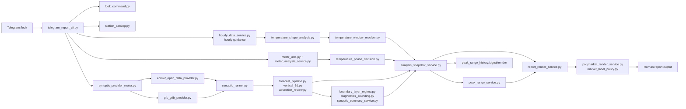
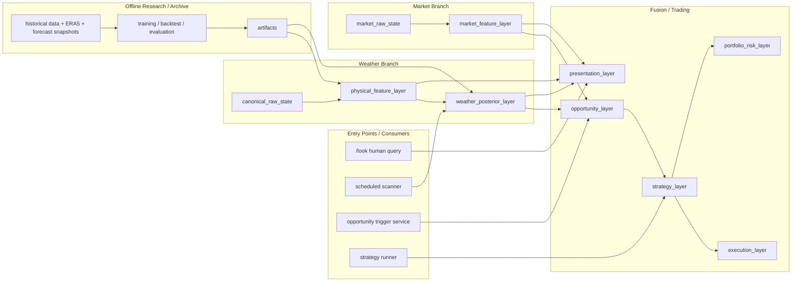

# polymarket-weatherbot

[English](./README.md) | [简体中文](./README.zh-CN.md)

> Station-centric weather intelligence runtime for Tmax analysis, market monitoring, opportunity detection, and eventually multi-strategy automated trading.

---

## Vision

`polymarket-weatherbot` is being built as a weather-first intelligence system for temperature markets.

The core idea is simple:

- use structured meteorological analysis, not just raw model output
- continuously update view with realtime observations
- estimate how the day's Tmax distribution is evolving
- compare that weather posterior with market pricing
- surface actionable opportunities for humans first, then for strategies and execution

`/look` is the Telegram-facing command used to view generated weather reports.
The same analysis core is intended to support:

- human-readable on-demand reports
- scheduled scanning
- automated opportunity triggers
- multi-strategy execution
- continuous learning from historical performance

---

## What The Project Does

### Weather-side capabilities

- station-level Tmax analysis
- hourly forecast window detection
- METAR-driven realtime correction
- synoptic and vertical-structure diagnostics
- multi-anchor 3D object tracking
- structured analysis snapshot generation

### Market-side direction

- Polymarket market interpretation and ladder rendering
- future CLOB price monitoring and orderbook-aware market features
- opportunity scoring from weather posterior vs market-implied pricing
- pluggable strategy and execution layers

### Research-side direction

- offline historical training
- ERA5 / forecast snapshot analysis
- artifact export back into the runtime
- continual model and calibration improvement

---

## Current Runtime Architecture

The current Telegram-facing runtime is exposed through `/look`, while the internal logic is already being moved into reusable layers.

### Runtime notes

- `open-meteo` remains the lightweight hourly primary
- `ECMWF Open Data` is now the default 3D synoptic source, with `GFS` fallback
- `analysis_snapshot` has become the main analysis handoff
- `canonical_raw_state.v1`, `posterior_feature_vector.v1`, `quality_snapshot.v1`, and a first calibrated `weather_posterior.v1` now live inside that snapshot
- `report_render_service.py` has been reduced to a render-only main path; old variable/market fallback inference has been removed

---

## Target Platform Architecture

The long-term platform should support both human-facing analysis and fully automated pipelines without rebuilding the weather logic each time.

This target design allows the same weather core to power:

- reports
- live scans
- trigger alerts
- multiple strategies
- automated execution

---

## Repository Boundary

This repository should be treated as the **runtime repository**.

### What belongs here

- realtime data access
- weather diagnostics
- structured contracts
- posterior-ready feature extraction
- market monitoring runtime
- report generation
- future strategy/execution runtime

### What should live elsewhere

In a separate research/archive repository:

- historical datasets
- ERA5 pipelines
- training workflows
- notebooks
- backtests
- calibration experiments
- offline evaluation

Preferred connection:

`research repo -> artifacts -> runtime repo`

Typical artifacts:

- station priors
- analog indices
- regime priors or embeddings
- posterior weights
- calibration tables
- manifests and schema versions

---

## Development Direction

The architecture is already cleaner than the old report-centric version, but several major layers are still being completed:

1. broader `canonical_raw_state` coverage
2. richer `posterior_feature_vector`
3. independent weather posterior layer
4. market websocket ingestion and market feature layer
5. opportunity, strategy, execution, and risk layers
6. artifact-driven integration with the research stack

---

## Key Modules

### Ingress

- `scripts/telegram_report_cli.py`
- `scripts/look_command.py`
- `scripts/station_catalog.py`

### Weather Providers and Diagnostics

- `scripts/hourly_data_service.py`
- `scripts/synoptic_provider_router.py`
- `scripts/ecmwf_open_data_provider.py`
- `scripts/gfs_grib_provider.py`
- `scripts/metar_utils.py`
- `scripts/metar_analysis_service.py`
- `scripts/sounding_obs_service.py`
- `scripts/synoptic_runner.py`
- `scripts/forecast_pipeline.py`
- `scripts/vertical_3d.py`
- `scripts/advection_review.py`
- `scripts/temperature_shape_analysis.py`
- `scripts/temperature_window_resolver.py`
- `scripts/temperature_phase_decision.py`
- `scripts/boundary_layer_regime.py`
- `scripts/diagnostics_sounding.py`
- `scripts/synoptic_summary_service.py`
- `scripts/peak_range_service.py`
- `scripts/peak_range_history_service.py`
- `scripts/peak_range_signal_service.py`
- `scripts/peak_range_render_service.py`
- `scripts/analysis_snapshot_service.py`
- `scripts/canonical_raw_state_service.py`
- `scripts/posterior_feature_service.py`

### Market and Presentation

- `scripts/report_render_service.py`
- `scripts/polymarket_render_service.py`
- `scripts/market_label_policy.py`
- `scripts/polymarket_client.py`
- `scripts/market_metadata_service.py`
- `scripts/market_stream_service.py`
- `scripts/market_monitor_service.py`
- `scripts/market_implied_weather_signal.py`
- `scripts/market_signal_alert_service.py`
- `scripts/alert_delivery_policy.py`
- `scripts/telegram_notifier.py`
- `scripts/market_alert_worker.py`

---

## Documentation

- Current runtime architecture: [`docs/core/ARCHITECTURE.md`](./docs/core/ARCHITECTURE.md)
- Market branch architecture: [`docs/core/MARKET_ARCHITECTURE.md`](./docs/core/MARKET_ARCHITECTURE.md)
- Market-implied alert plan: [`docs/core/MARKET_IMPLIED_REPORT_SIGNAL_PLAN.md`](./docs/core/MARKET_IMPLIED_REPORT_SIGNAL_PLAN.md)
- Target architecture: [`docs/core/TARGET_ARCHITECTURE.md`](./docs/core/TARGET_ARCHITECTURE.md)
- Runtime contracts: [`docs/core/DECISION_SCHEMA.md`](./docs/core/DECISION_SCHEMA.md), [`docs/core/FORECAST_3D_STORAGE.md`](./docs/core/FORECAST_3D_STORAGE.md)
- Output rules: [`docs/core/LOOK_OUTPUT_CONTRACT.md`](./docs/core/LOOK_OUTPUT_CONTRACT.md)
- Guardrails and technical notes: [`docs/core/AGENT_UPDATE_GUARDRAILS.md`](./docs/core/AGENT_UPDATE_GUARDRAILS.md), [`docs/core/TECHNICAL_IMPLEMENTATION_NOTES.md`](./docs/core/TECHNICAL_IMPLEMENTATION_NOTES.md)
- Research handoff: [`docs/core/HISTORICAL_RESEARCH_HANDOFF.md`](./docs/core/HISTORICAL_RESEARCH_HANDOFF.md)
- Alert worker operations: [`docs/operations/MARKET_ALERT_WORKER.md`](./docs/operations/MARKET_ALERT_WORKER.md)
- Full docs index: [`DOCS_INDEX.md`](./DOCS_INDEX.md)

---

## Status

The project has already crossed the “single report script” stage.  
It is now being turned into a reusable weather intelligence runtime that can eventually operate both with and without a human command loop.
