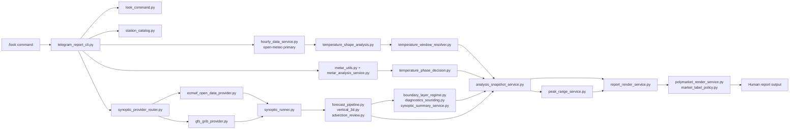
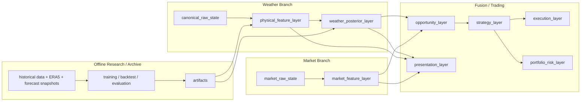

# polymarket-weatherbot

Station-centric Tmax analysis runtime for `/look`, designed to evolve from a human-readable weather report skill into a structured posterior, market monitoring, and multi-strategy trading support system.

## Overview

`polymarket-weatherbot` is the runtime-side repository for intraday Tmax analysis.

Today it focuses on:

- station-level Tmax analysis
- realtime METAR-aware forecast correction
- 3D synoptic context and tracking
- structured report generation
- Polymarket-facing market interpretation

The architecture is intentionally moving away from a report-driven design toward a layered analysis system:

- weather inference should be reusable outside the report
- market monitoring should not pollute weather logic
- strategy and execution should be independent of the presentation layer
- historical training should live outside the runtime repo

## Design Principles

- Forecast-first, but observation-corrected
- Structured contracts before narrative text
- Weather analysis and market logic remain one-way coupled
- Runtime stays lightweight; historical training and large datasets stay outside
- Current implementation and target architecture are documented separately

## Current Runtime Architecture

Current runtime notes:

- hourly guidance remains lightweight and fast
- 3D synoptic background is now `ECMWF Open Data` primary with `GFS` fallback
- `analysis_snapshot` is the main render handoff
- report generation is no longer the only place where Tmax logic lives

## Target Architecture

The runtime above is not the final form.  
The target design separates weather inference, market state, strategy, and research artifacts more explicitly.

This target architecture allows:

- a report layer that only maps structured analysis to text
- a probability/posterior layer that is independent of presentation
- real-time market monitoring, including websocket-based price streams
- multiple strategy modules sharing a common opportunity layer
- separate research and runtime repos linked by lightweight artifacts

## Repository Role

This repository should be treated as the **runtime repo**, not the full research platform.

What belongs here:

- realtime data fetch and normalization
- forecast and observation diagnostics
- structured analysis and posterior-ready contracts
- report rendering
- market monitoring and future strategy/execution runtime

What should live in a separate research/archive repo:

- historical data lake
- ERA5 extraction
- large offline feature tables
- training pipelines
- notebooks
- backtests
- model selection and evaluation workflows

The preferred connection is:

`research repo -> artifacts -> runtime repo`

Examples of artifacts:

- station priors
- analog index
- regime priors / embeddings
- posterior model weights
- calibration tables
- manifest / schema version

## Current Strengths

- provider routing is explicit instead of hardcoded to one synoptic source
- 3D diagnostics support light multi-anchor tracking
- market display is already mostly decoupled from weather-side logic
- `analysis_snapshot` provides a reusable analysis handoff
- docs now distinguish current runtime architecture from target architecture

## Current Gaps

The most important missing pieces are:

1. a formal `canonical_raw_state`
2. a formal `posterior_feature_vector`
3. a dedicated posterior layer
4. a fully separate strategy / execution / risk stack
5. a stable artifact loader for research outputs

## Key Modules

### Ingress / Routing

- `scripts/telegram_report_cli.py`
- `scripts/look_command.py`
- `scripts/station_catalog.py`

### Providers

- `scripts/hourly_data_service.py`
- `scripts/synoptic_provider_router.py`
- `scripts/ecmwf_open_data_provider.py`
- `scripts/gfs_grib_provider.py`
- `scripts/metar_utils.py`
- `scripts/sounding_obs_service.py`

### Analysis

- `scripts/synoptic_runner.py`
- `scripts/forecast_pipeline.py`
- `scripts/vertical_3d.py`
- `scripts/advection_review.py`
- `scripts/temperature_shape_analysis.py`
- `scripts/temperature_window_resolver.py`
- `scripts/temperature_phase_decision.py`
- `scripts/boundary_layer_regime.py`
- `scripts/diagnostics_sounding.py`
- `scripts/synoptic_summary_service.py`
- `scripts/peak_range_service.py`
- `scripts/analysis_snapshot_service.py`

### Presentation / Market

- `scripts/report_render_service.py`
- `scripts/polymarket_render_service.py`
- `scripts/market_label_policy.py`
- `scripts/polymarket_client.py`

## Documentation Guide

- Current runtime structure:
  - [ARCHITECTURE.md](/home/ubuntu/.openclaw/workspace/skills/polymarket-weatherbot/docs/core/ARCHITECTURE.md)
- Target design:
  - [TARGET_ARCHITECTURE.md](/home/ubuntu/.openclaw/workspace/skills/polymarket-weatherbot/docs/core/TARGET_ARCHITECTURE.md)
- Runtime contracts:
  - [DECISION_SCHEMA.md](/home/ubuntu/.openclaw/workspace/skills/polymarket-weatherbot/docs/core/DECISION_SCHEMA.md)
  - [FORECAST_3D_STORAGE.md](/home/ubuntu/.openclaw/workspace/skills/polymarket-weatherbot/docs/core/FORECAST_3D_STORAGE.md)
  - [LOOK_OUTPUT_CONTRACT.md](/home/ubuntu/.openclaw/workspace/skills/polymarket-weatherbot/docs/core/LOOK_OUTPUT_CONTRACT.md)
- Engineering notes and guardrails:
  - [TECHNICAL_IMPLEMENTATION_NOTES.md](/home/ubuntu/.openclaw/workspace/skills/polymarket-weatherbot/docs/core/TECHNICAL_IMPLEMENTATION_NOTES.md)
  - [AGENT_UPDATE_GUARDRAILS.md](/home/ubuntu/.openclaw/workspace/skills/polymarket-weatherbot/docs/core/AGENT_UPDATE_GUARDRAILS.md)
- Research handoff:
  - [HISTORICAL_RESEARCH_HANDOFF.md](/home/ubuntu/.openclaw/workspace/skills/polymarket-weatherbot/docs/core/HISTORICAL_RESEARCH_HANDOFF.md)
  - [DOCS_INDEX.md](/home/ubuntu/.openclaw/workspace/skills/polymarket-weatherbot/DOCS_INDEX.md)

## Status

The runtime architecture is already materially cleaner than the earlier report-centric version, but it should still be treated as an intermediate stage on the path to:

- posterior-driven weather inference
- websocket-backed market monitoring
- multi-strategy trading support
- offline-trained artifacts feeding a lightweight runtime
