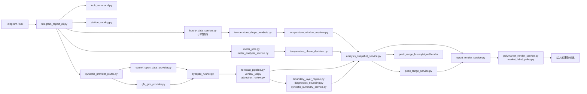
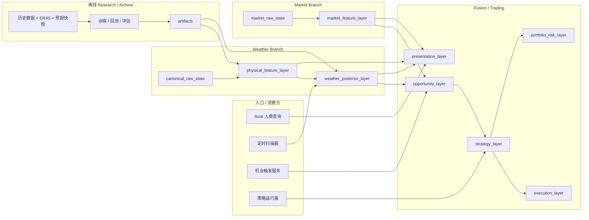

# polymarket-weatherbot

[English](./README.md) | [简体中文](./README.zh-CN.md)

> 面向温度市场的站点级天气智能运行时，用于 Tmax 分析、市场监控、机会识别，并逐步演进到多策略自动交易支持。

---

## 项目愿景

`polymarket-weatherbot` 正在被构建成一个 **weather-first** 的温度市场智能系统。

核心思路是：

- 不只看原始模式，而是做结构化天气分析
- 用实时实况不断修正当天 Tmax 的演变判断
- 估计最高温分布和关键事件概率
- 将天气后验与市场定价进行比较
- 先给人提供可操作信息，再逐步支持策略和执行

`/look` 是面向 Telegram 端查看天气报告的命令入口。  
同一套天气分析核心，未来希望同时支持：

- 面向人的按需分析报告
- 定时扫描
- 自动机会触发
- 多策略运行
- 基于历史表现的持续学习更新

---

## 这个项目现在在做什么

### 天气侧能力

- 站点级日最高温分析
- 小时预报峰值窗口识别
- 基于 METAR 的实时修正
- 环流与垂直结构诊断
- 多 anchor 的 3D 系统 tracking
- 结构化分析快照生成

### 市场侧演进方向

- Polymarket 市场解释与档位展示
- 后续接入 CLOB websocket 的价格与盘口监控
- 基于天气后验 vs 市场定价的偏差识别
- 可插拔的策略层与执行层

### 研究侧演进方向

- 历史训练
- ERA5 / 预报快照分析
- 训练产物回灌 runtime
- 持续校准与学习

---

## 当前 Runtime 架构

当前 Telegram 侧主要通过 `/look` 输出报告，但内部逻辑已经开始向可复用层收拢。

### 当前 runtime 特点

- `open-meteo` 仍作为轻量小时预报 primary
- `ECMWF Open Data` 已成为默认 3D 背景源，`GFS` 作为 fallback
- `analysis_snapshot` 已成为分析层到报告层的主要 handoff
- `canonical_raw_state.v1`、`posterior_feature_vector.v1`、`quality_snapshot.v1` 以及首版已校准的 `weather_posterior.v1` 已接入 snapshot
- `report_render_service.py` 已收成 render-only 主路径，旧的变量/市场 fallback 推理已移除

---

## 目标平台架构

长期目标是让系统既能服务人，也能服务自动化扫描与策略执行。

这意味着同一套天气核心未来可以同时支撑：

- 报告
- 自动扫描
- 机会触发
- 多策略运行
- 自动执行

---

## 仓库边界

这个仓库应被视为 **runtime 仓库**。

### 适合放在这里的内容

- 实时数据接入
- 天气诊断
- 结构化 contract
- 面向 posterior 的 feature 提取
- 市场监控运行时
- 报告生成
- 后续策略 / 执行运行时

### 更适合放到独立 research/archive 仓库的内容

- 历史数据湖
- ERA5 管线
- 大体量离线特征表
- 训练流程
- notebook
- 回测
- 校准实验

推荐连接方式：

`research repo -> artifacts -> runtime repo`

典型 artifact 包括：

- station priors
- analog index
- regime priors / embeddings
- posterior 权重
- calibration tables
- manifest / schema version

---

## 当前开发方向

项目已经明显走出了“单个报告脚本”的阶段，但下面几层还在继续完善：

1. 更完整的 `canonical_raw_state`
2. 更成熟的 `posterior_feature_vector`
3. 独立的天气 posterior 层
4. 市场 websocket 接入与市场 feature layer
5. opportunity / strategy / execution / risk 层
6. artifact 驱动的 research-runtime 连接

---

## 关键模块

### 入口层

- `scripts/telegram_report_cli.py`
- `scripts/look_command.py`
- `scripts/station_catalog.py`

### 天气 Provider 与诊断层

- `scripts/hourly_data_service.py`
- `scripts/synoptic_provider_router.py`
- `scripts/ecmwf_open_data_provider.py`
- `scripts/gfs_grib_provider.py`
- `scripts/metar_utils.py`
- `scripts/metar_analysis_service.py`
- `scripts/sounding_obs_service.py`
- `scripts/synoptic_runner.py`
- `scripts/forecast_pipeline.py`
- `scripts/vertical_3d.py`
- `scripts/advection_review.py`
- `scripts/temperature_shape_analysis.py`
- `scripts/temperature_window_resolver.py`
- `scripts/temperature_phase_decision.py`
- `scripts/boundary_layer_regime.py`
- `scripts/diagnostics_sounding.py`
- `scripts/synoptic_summary_service.py`
- `scripts/peak_range_service.py`
- `scripts/peak_range_history_service.py`
- `scripts/peak_range_signal_service.py`
- `scripts/peak_range_render_service.py`
- `scripts/analysis_snapshot_service.py`
- `scripts/canonical_raw_state_service.py`
- `scripts/posterior_feature_service.py`

### 市场与展示层

- `scripts/report_render_service.py`
- `scripts/polymarket_render_service.py`
- `scripts/market_label_policy.py`
- `scripts/polymarket_client.py`
- `scripts/market_metadata_service.py`
- `scripts/market_stream_service.py`
- `scripts/market_monitor_service.py`
- `scripts/market_implied_weather_signal.py`
- `scripts/market_signal_alert_service.py`
- `scripts/alert_delivery_policy.py`
- `scripts/telegram_notifier.py`
- `scripts/market_alert_worker.py`

---

## 文档导航

- 当前 runtime 架构：[`docs/core/ARCHITECTURE.md`](./docs/core/ARCHITECTURE.md)
- 市场分支架构：[`docs/core/MARKET_ARCHITECTURE.md`](./docs/core/MARKET_ARCHITECTURE.md)
- 盘口异动信号方案：[`docs/core/MARKET_IMPLIED_REPORT_SIGNAL_PLAN.md`](./docs/core/MARKET_IMPLIED_REPORT_SIGNAL_PLAN.md)
- 目标架构：[`docs/core/TARGET_ARCHITECTURE.md`](./docs/core/TARGET_ARCHITECTURE.md)
- 运行时 contract：[`docs/core/DECISION_SCHEMA.md`](./docs/core/DECISION_SCHEMA.md), [`docs/core/FORECAST_3D_STORAGE.md`](./docs/core/FORECAST_3D_STORAGE.md)
- 输出规则：[`docs/core/LOOK_OUTPUT_CONTRACT.md`](./docs/core/LOOK_OUTPUT_CONTRACT.md)
- 工程护栏与实现备注：[`docs/core/AGENT_UPDATE_GUARDRAILS.md`](./docs/core/AGENT_UPDATE_GUARDRAILS.md), [`docs/core/TECHNICAL_IMPLEMENTATION_NOTES.md`](./docs/core/TECHNICAL_IMPLEMENTATION_NOTES.md)
- 研究对接：[`docs/core/HISTORICAL_RESEARCH_HANDOFF.md`](./docs/core/HISTORICAL_RESEARCH_HANDOFF.md)
- 告警 worker 运维说明：[`docs/operations/MARKET_ALERT_WORKER.md`](./docs/operations/MARKET_ALERT_WORKER.md)
- 文档总索引：[`DOCS_INDEX.md`](./DOCS_INDEX.md)

---

## 当前状态

这个项目现在已经不只是“生成一份 `/look` 报告”的技能脚本，而是在逐步变成一个既能给人用、也能被自动化系统复用的天气智能运行时。
