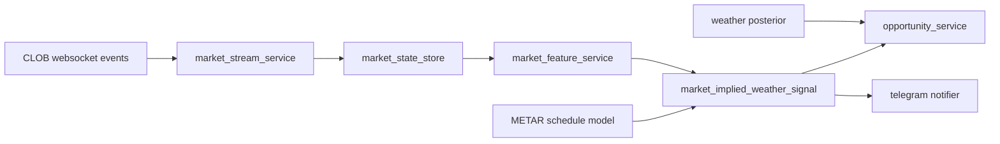

# Market-Implied Report Signal Plan

Last updated: 2026-03-12

## Goal

Use abrupt Polymarket orderbook repricing around routine METAR issue times as a **public-market proxy signal** for the next observation.

This is not treated as factual weather data.
It is treated as:

- a market-implied lower/upper bound hint for the next report
- an early public signal that may carry alpha before the official report is visible in the bot pipeline

## Core Hypothesis

Near the routine METAR report window, a sudden collapse in a bucket that should remain tradable until the next report can imply that the market has already repriced on new information.

Example:

- market: `6°C or below`
- before report: `best_bid >= 0.02`
- during `+0.5 to +5 minutes` after routine report time: `best_bid -> 0` or `best_ask <= 0.01`
- this can imply the market is already trading as if the latest report is `> 6°C`

This does **not** require `7°C` or `8°C` buckets to rise immediately.
That secondary repricing may lag.
For alpha purposes, the first useful inference can simply be:

- `market_implied_report_lower_bound >= 7°C`

When scanning upside buckets, the preferred rule is:

- scan upward in ascending temperature order
- stop at the first bucket that has **not** been invalidated
- treat that bucket as the current best market-implied temperature slot

Example:

- `6°C` bucket is invalidated
- `7°C` bucket is still alive
- stop there and infer the market is currently trading around `7°C`

If all lower buckets are invalidated and the first surviving bucket is `12°C or higher`, then treat that as a top-bucket lock-in style signal.

## What The Signal Can And Cannot Mean

Can mean:

- market participants repriced on a new public/near-public update
- one side of the bound is suddenly no longer credible
- a fresh observation may already invalidate a lower bucket

Cannot prove:

- anyone had privileged access
- the exact new report temperature
- the final daily Tmax bucket

Therefore the system should phrase the result as:

- `盘口归零异动`
- `市场隐含最新报下界`
- `market-implied observation hint`

Not as:

- `最新报已确认是 7°C`

## Proposed Runtime Placement



This module should sit on the market side, not inside `/look`.

## Input Contract

Suggested per-bucket snapshot fields:

- `bucket_label`
- `bucket_kind`
  - `exact`
  - `range`
  - `at_or_below`
  - `at_or_above`
- `threshold_c`
- `best_bid`
- `best_ask`
- `prev_best_bid`
- `prev_best_ask`
- `last_trade_price`
- `trade_count_3m`
- `top_depth_bid`
- `top_depth_ask`
- `book_timestamp_utc`

Runtime context:

- `scheduled_report_utc`
- `now_utc`
- `latest_observed_temp_c` (optional)
- `continuous_mode` (optional)
- `previous_state` is optional, but resident mode should not depend on cross-block inherited baseline

## First Signal Family

### `report_temp_lower_bound_jump`

Trigger intent:

- lower bucket suddenly dies near report time

Baseline trigger:

- bucket kind is `at_or_below`
- threshold is `X`
- previous `best_bid >= 0.02`
- event occurs within `[+30s, +300s]` of scheduled report time
- and one of:
  - current `best_bid <= 0.001` or no meaningful bid
  - current `best_ask <= 0.01`

Optional strengthen conditions:

- both `bid` and `ask` collapse together
- `last_trade_price <= 0.02`
- at least one recent trade

Output:

- `implied_report_temp_lower_bound_c = X + 1`
- confidence label
- evidence payload
- human alert message

Resident-mode adjustment:

- when a station is in resident monitoring mode, the trigger window gate is opened continuously
- entering resident mode should discard inherited baseline state
- when the station re-enters routine mode, a fresh pre-report baseline should be built again
- duplicate suppression should key on market identity + bucket identity, not only routine report timestamp

### `report_temp_scan_floor_stop`

Trigger intent:

- sequential upside scan has reached the first still-live bucket

Rule:

- scan exact / `or higher` buckets in ascending temperature order
- starting from the currently relevant observed bucket
- consecutive lower buckets have been invalidated
- stop at the first bucket that remains live

Output:

- inferred market-implied temperature slot = first live bucket
- if that bucket is exact, treat it as the current best implied slot
- if that bucket is `or higher`, treat it as a top-bucket lock-in style signal

## Why Adjacent Buckets Need Not Move First

The main alpha is often in the **bucket that just became impossible**.

Example:

- if `6°C or below` suddenly loses all meaningful bid near report time
- the strongest immediate inference is simply `latest report > 6°C`

The `7°C` and `8°C` buckets may reprice seconds later.
Waiting for them can reduce timeliness.

So the detector should support:

- **single-bucket hard invalidation**

before requiring:

- multi-bucket confirmation

Multi-bucket confirmation can still be used to upgrade confidence.

## Resident Monitoring Adjustment

Resident mode exists to cover stations that have entered a more unstable reporting regime even if the very first SPECI is not known in real time.

Recommended resident entry rule:

- `recent_speci_2h`
- or `speci_active`
- or `speci_likely`

Recommended runtime behavior:

- keep monitoring in short rolling blocks
- do not let resident blocks overlap the next routine report window
- allow `ascending scan` and `dead_now` style triggers outside the normal report-time gate
- still keep cooldown / dedupe so one market structure does not spam repeated pushes

## Telegram Push Feasibility

Yes, this can push to a Telegram group chat.

Required:

- a bot token
- the bot added to the target group
- the target group chat id

Recommended env:

- `TELEGRAM_BOT_TOKEN`
- `TELEGRAM_ALERT_CHAT_ID`

Current repo status:

- there is runtime Telegram context for `/look`
- there is now a dedicated proactive notifier path:
  - `market_monitor_service.py`
  - `market_signal_alert_service.py`
  - `market_alert_delivery_service.py`
  - `market_alert_worker.py`

Push format should be short:

```text
盘口归零异动
London | 常规报后 0.5-5 分钟
`6°C or below` 买盘被扫空 / ask 下压到 0.01
市场隐含最新报下界：>= 7°C
说明：这只是市场先行反应，不等于官方实况已确认
```

## Monitoring Cost

### Network / transport

Low to medium.

- one websocket connection can cover many subscribed assets
- keepalive / reconnect cost is small
- public market channel is suitable for continuous monitoring

### CPU / memory

Low for first version.

- top-of-book monitoring is cheap
- even tracking dozens to low hundreds of assets is lightweight
- full orderbook reconstruction costs more, but still modest at small scale

### Engineering complexity

Medium.

Main work is not compute cost.
Main work is:

- stable websocket ingestion
- mapping event markets to bucket metadata
- defining false-positive filters
- scheduling around routine report windows
- routing alerts safely

### Operational complexity

Medium.

Need to manage:

- duplicate alert suppression
- group-specific routing
- noisy thin markets
- alert fatigue

## Recommended Rollout

### Phase 1: detect-only

- subscribe to websocket
- build per-bucket top-of-book snapshots
- detect `report_temp_lower_bound_jump`
- log locally, no external push

### Phase 2: alert-only

- enable Telegram group alerts
- add per-market cool-down
- add confidence filters

### Phase 3: fusion

- merge signal into `opportunity_service`
- compare market-implied bound with weather posterior
- rank alpha opportunities

### Phase 4: strategy usage

- allow strategy layer to consume the signal
- still keep it separate from weather truth inference

## Guardrails

- never overwrite observed weather data with market-implied data
- phrase output as `market-implied` / `盘口归零异动`
- require report-window timing for strongest alerts
- suppress alerts in very thin markets unless evidence is unusually strong
- keep strategy/execution downstream of this signal

## Current First-Step Implementation

The repo currently uses:

- `scripts/market_implied_weather_signal.py`
  - pure structured detector
- `scripts/market_signal_alert_service.py`
  - Telegram formatter
- `scripts/market_alert_delivery_service.py`
  - cooldown / dedupe / delivery wrapper
- `scripts/market_alert_worker.py`
  - proactive runtime entrypoint

## References

- WebSocket Overview:
  - https://docs.polymarket.com/market-data/websocket/overview
- Market Channel:
  - https://docs.polymarket.com/market-data/websocket/market-channel
- Gamma market structure:
  - https://docs.polymarket.com/developers/gamma-markets-api/gamma-structure
