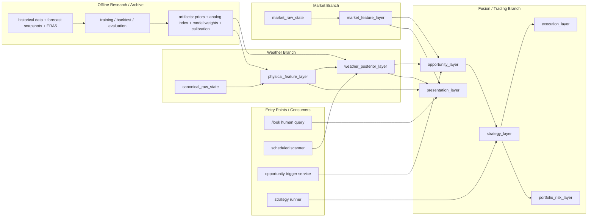

# Target Architecture

Last updated: 2026-03-09

本文描述 weatherbot 的目标架构，不等同于“当前代码已全部实现”。  
当前运行时现状请看 [ARCHITECTURE.md](/home/ubuntu/.openclaw/workspace/skills/polymarket-weatherbot/docs/core/ARCHITECTURE.md)。

市场主链与 CLI / websocket 分工请看 [MARKET_ARCHITECTURE.md](/home/ubuntu/.openclaw/workspace/skills/polymarket-weatherbot/docs/core/MARKET_ARCHITECTURE.md)。

## 1) 设计目标

新版架构需要同时满足 4 个目标：

- 天气分析链路清晰、可复用、可维护
- 报告层只是输出模块，不反向定义分析逻辑
- 市场/策略/执行能独立扩展，不污染天气判断
- 历史训练和大体量数据处理与 runtime 分离
- 人类查询入口（如 `/look`）只是其中一个消费者，而不是系统运行的唯一方式

## 2) 目标架构总览

## 3) 各层职责

### A. `canonical_raw_state`

职责：统一 runtime 原始状态，不做解释。

建议内容：

- hourly forecast
- 3D field bundle
- METAR observations
- sounding / sounding proxy inputs
- station metadata
- runtime quality metadata

约束：

- 不放 `headline`
- 不放 `summary_line`
- 不放任何给人看的解释句

### B. `physical_feature_layer`

职责：从原始状态提取程序友好、尽量正交的物理特征。

典型轴：

- time phase
- observed temperature state
- cloud / radiation state
- moisture / stability state
- mixing / coupling state
- thermal transport / advection state
- vertical structure / layer relationships
- quality / uncertainty state

输出形式应以：

- 连续值
- 有限枚举
- 布尔事件

为主，而不是 narrative text。

### C. `weather_posterior_layer`

职责：输出量化后验，而不是文本结论。

最小输出建议：

- `tmax_quantiles`
- `bucket_probs`
- `event_probs`
  - `P(new_high_next_60m)`
  - `P(lock_by_window_end)`
  - `P(exceed_strike_x)`
- `peak_time_probs`

### D. `market_raw_state`

职责：统一市场原始状态。

建议来源：

- Gamma metadata
- Polymarket CLOB websocket / REST snapshot
- orderbook / BBA / last trade
- resolution / suspension state

### E. `market_feature_layer`

职责：把市场流转成可比较的量化指标。

建议输出：

- mid
- spread
- top-of-book depth
- imbalance
- staleness
- short-horizon momentum
- market-implied bucket distribution

### F. `opportunity_layer`

职责：让天气后验和市场状态在此汇合，识别偏差。

建议输出：

- fair value
- market implied value
- edge
- mispricing score
- tradability score

### G. `strategy_layer`

职责：允许多策略共存，但输出统一的 strategy intent。

策略例子：

- passive value
- window breakout
- late lock / settled-post
- mean reversion
- event volatility

统一输出建议：

- `strategy_id`
- `market_slug`
- `bucket_id`
- `side`
- `fair_value`
- `target_entry`
- `max_size`
- `urgency`
- `ttl_seconds`
- `cancel_if`
- `risk_tags`

### H. `execution_layer`

职责：把 strategy intent 变成订单行为。

不负责：

- 天气判断
- 市场偏差识别
- 策略选择

### I. `portfolio_risk_layer`

职责：统一限额、熔断、相关性和回撤管理。

## 4) Runtime Repo 与 Research Repo 边界

目标推荐采用双仓模式：

- `weatherbot-runtime`
  - 当前这个 skill repo
  - 负责实时分析、报告、市场监控、策略与执行
- `weatherbot-research`
  - 负责历史数据、ERA5、样本构建、训练、回测、评估

runtime 不直接依赖 research repo 的原始数据和训练脚本。

## 5) Artifact 连接方式

research repo 通过 artifact 与 runtime 对接。

建议 artifact 类型：

- `station_priors`
- `regime_priors`
- `analog_index`
- `feature_normalization`
- `posterior_weights`
- `calibration_tables`
- `manifest`

runtime 只通过 loader 读取这些轻量产物。

## 6) 迁移顺序建议

1. 扩展 `canonical_raw_state` 的字段覆盖，并继续移除零散文本兜底依赖
2. 扩展 `posterior_feature_vector.v1` 的正交特征覆盖
3. 将 `weather_posterior.v1` 从当前 `core + calibration hook` 继续推进为可校准 posterior
4. 继续扩 `quality_snapshot`
5. 继续将 `peak_range_service` 从当前 core/history/signal/render 四块推进为更清晰的 posterior core
6. 把 3D tracking summary 升为一级输入
7. 再接 market websocket / opportunity / strategy / execution

## 7) 当前实现与目标架构的关系

当前代码已经具备以下目标架构雏形：

- provider router
- forecast decision
- analysis snapshot
- `canonical_raw_state.v1`
- `posterior_feature_vector.v1`
- `quality_snapshot.v1`
- `weather_posterior.v1`
- market render

但仍未完全具备：

- 完整展开的 canonical raw coverage
- 更成熟的 posterior feature coverage
- 更成熟、可校准的 posterior 层
- 更完整的 quality / uncertainty contract
- 独立 strategy / execution / risk 层
